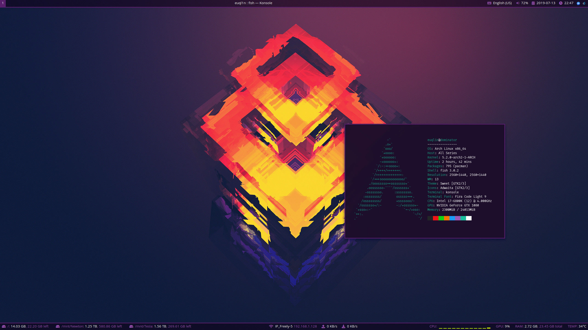

# Tim's dotfiles

Collection of dotfiles for my Arch Linux setup. Dotfile management is done
using [yadm](https://github.com/TheLocehiliosan/yadm).



# Shell

* `fish` shell with `fisher` package manager.
* `konsole` terminal emulator. `FiraProf` profile needs to be enabled after setup.
* `neovim` editor.
* `yay` AUR helper.

# GUI

* `lightdm` display manager with `lightdm-webkit2-greeter`.
* `i3-gaps` window manager (doubles as a DE).
* `rofi` application launcher.
* `polybar` status bar.

# Other

* `shutter` screenshot tool.
* `pulseaudio` for sound control, with `pulseaudio-alsa`.
* `mopidy` for music, with `mpc` package to enable keyboard media keys.
* `otf-fira-code` console font.
* `ttf-opensans` font for app launcher.
* `ttf-ms-fonts` fonts for general use.
* `ttf-font-awesome`, `ttf-symbola` for icons.

# Notes

These lines should be added to `/etc/profile`:
```bash
appendpath "/home/$USER/.local/bin"
SUDO_EDITOR=/usr/bin/nvim
export SUDO_EDITOR
```

